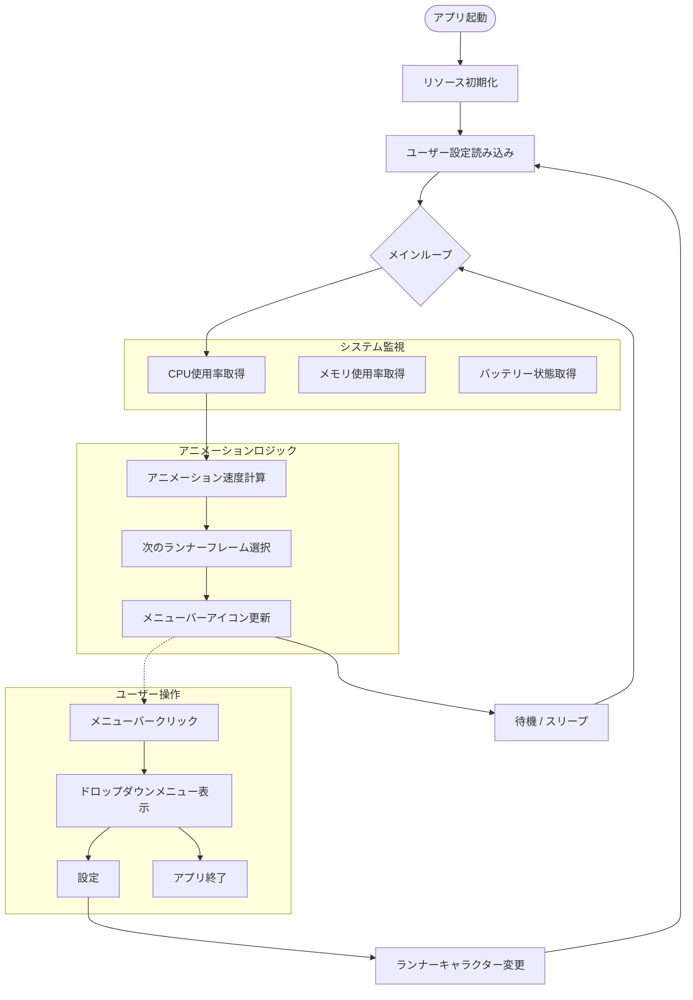

```mermaid
graph TD
    Start([アプリ起動]) --> Init[リソース初期化]
    Init --> LoadConfig[ユーザー設定読み込み]
    LoadConfig --> MainLoop{メインループ}

    subgraph "システム監視"
        GetCPU[CPU使用率取得]
        GetMem[メモリ使用率取得]
        GetBatt[バッテリー状態取得]
    end

    subgraph "アニメーションロジック"
        CalcSpeed[アニメーション速度計算]
        SelectFrame[次のランナーフレーム選択]
        UpdateIcon[メニューバーアイコン更新]
    end

    MainLoop --> GetCPU
    GetCPU --> CalcSpeed
    CalcSpeed --> SelectFrame
    SelectFrame --> UpdateIcon
    UpdateIcon --> Wait[待機 / スリープ]
    Wait --> MainLoop

    subgraph "ユーザー操作"
        Click[メニューバークリック]
        ShowMenu[ドロップダウンメニュー表示]
        Prefs[設定]
        Quit[アプリ終了]
    end

    UpdateIcon -.-> Click
    Click --> ShowMenu
    ShowMenu --> Prefs
    ShowMenu --> Quit
    Prefs --> ChangeRunner[ランナーキャラクター変更]
    ChangeRunner --> LoadConfig
```
